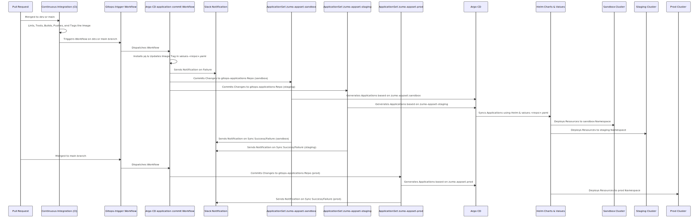

This README provides a comprehensive explanation of the updated GitOps workflow diagram, which visualizes the deployment process across different environments and clusters, utilizing GitHub Actions, ArgoCD, ApplicationSets, and Continuous Integration (CI) processes.

## Diagram Overview

This diagram represents a sequence of steps initiated by a Pull Request being merged to either `dev` or `main` branches, leading to deployments in different Kubernetes clusters. The workflow is divided into several stages, each representing a specific task or process in the deployment pipeline.

### Stages of the Workflow##

1. **Continuous Integration (CI) Process**
   - Triggered when a PR is merged to `dev` or `main`.
   - It lints, tests, builds, pushes, and tags the image.

2. **Code Change Trigger**
   - A change is made to the codebase, triggering the `Gitops-trigger` GitHub Actions workflow.
   - This workflow generates a token and dispatches another workflow in the `gitops-applications` repository, passing relevant information such as commit_id, repo_name, and environment.

3. **Argo CD Application Commit**
   - Triggered by the `workflow_dispatch` event, this workflow generates another token and checks out the code in the `dev` branch.
   - It updates the image tag in the `values-<repo_name>.yaml` file and commits the changes.
   - If the commit fails, it retries the commit and sends a failure notification to Slack if the retry also fails.

4. **ApplicationSet Configuration**
   - The ApplicationSet, defined in the `zenith-appset-prod`, watches for changes in the `gitops-applications` repository and deploys applications based on the configurations in the `*.yaml` files located in the `prod/config/pilotgab-appset/` directory.
   - It deploys to the specified namespace in the `prod` project of the ArgoCD, located in the Kubernetes cluster.

### Environments and Clusters

- **Sandbox and Staging Clusters:** Triggered by merging and pushing to the `dev` branch.
- **Prod Cluster:** Triggered by merging and pushing to the `master` branch.

## Workflow Details

### 1. Continuous Integration (CI) Process

This process is initiated by any Pull Request being merged to `dev` or `main`. It is responsible for linting, testing, building, pushing, and tagging the image.

### 2. Gitops-trigger Workflow

This workflow is initiated by any code change in the repository. It is responsible for generating a GitHub token and triggering the `Argo CD application commit` workflow in the `gitops-applications` repository with the necessary inputs.

### 3. Argo CD Application Commit Workflow

This workflow is responsible for:
   - Generating a token for checking out the code and committing changes.
   - Installing `yq` for YAML processing.
   - Updating the image tag in the respective `values-<repo_name>.yaml` file.
   - Committing and pushing the changes to the `dev` branch.
   - Sending a notification to Slack in case of failure.

### 4. ApplicationSet Deployment

The ApplicationSet object, `pilotgab-appset-prod`, is configured to watch the `gitops-applications` repository for changes and deploy applications based on the YAML configurations in the specified path. It deploys the applications to the `prod` project in ArgoCD, which is located in the Kubernetes cluster.

### Clusters and Deployment Strategy

- **Prod Cluster:** Deployments are triggered by merging and pushing to the `master` branch.
- **Sandbox and Staging Clusters:** Deployments are triggered by merging and pushing to the `dev` branch.

